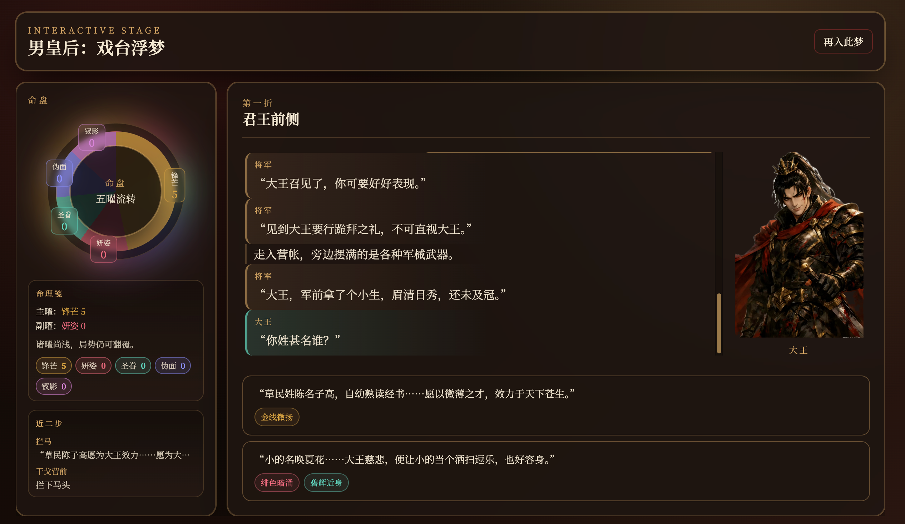
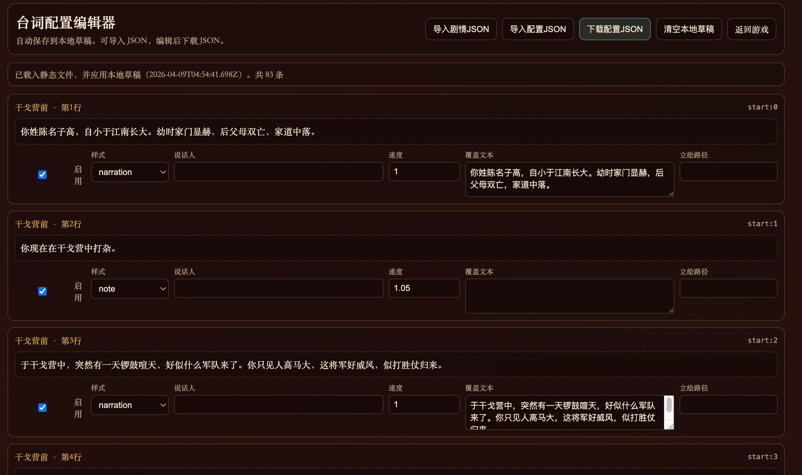

# 男皇后：戏台浮梦

### [游戏链接](https://chr0mium24.github.io/shenlong/)
基于台本改编的网页互动叙事游戏。

- 前端：原生 JS + Tailwind（CDN）
- 运行：`pnpm` + `express` 静态服务
- 数据：`data/shenlong-pack.json`（剧情包）+ `data/manual-line-cues.json`（逐行演出配置）

## 截图

### 游戏界面



### 台词配置编辑器



## 本地运行

### 1) 安装依赖

```bash
pnpm install
```

### 2) 启动

开发模式（热重载）：

```bash
pnpm dev
```

或直接启动：

```bash
pnpm start
```

也可以使用脚本：

```bash
./run.sh dev
# 或
./run.sh start
```

默认地址：`http://localhost:3000`

## 页面入口

- 游戏：`/index.html`
- 编辑器：`/editor.html`

## 编辑器工作流（静态模式）

编辑器不再调用后端 API，使用“导入/下载 JSON”流程：

1. 打开 `/editor.html`
2. 点击“导入剧情JSON”（可选，默认读取 `data/shenlong-pack.json`）
3. 点击“导入配置JSON”（可选，默认读取 `data/manual-line-cues.json`）
4. 修改行样式、说话人、速度、立绘路径
5. 点击“下载配置JSON”导出
6. 用导出的文件替换 `data/manual-line-cues.json`

说明：编辑器会自动保存本地草稿到 `localStorage`。

## 数据关系

- `data/shenlong-pack.json`：剧情节点、选项、数值变化、角色立绘映射等“主数据”。
- `data/manual-line-cues.json`：对 `nodeId:lineIndex` 的逐行覆盖（`style/speaker/text/speed/portrait`）。
- 引擎会先读取主剧情行，再按 `manual-line-cues` 做覆盖。

## GitHub Pages 部署

仓库已包含 workflow：

- `.github/workflows/deploy-pages.yml`

推送到 `main` 后自动部署。首次使用需在仓库设置里确认：

1. `Settings -> Pages`
2. Source 选择 `GitHub Actions`

构建命令（本地可验证）：

```bash
pnpm build:pages
```

产物目录：`dist-pages/`

## 目录概览

```text
public/                  # 前端页面与运行时代码
  index.html             # 游戏页面
  editor.html            # 台词配置编辑器
  game/                  # 舞台渲染
  engine/                # 剧情引擎
  portraits/             # 立绘

data/
  shenlong-pack.json     # 剧情包
  manual-line-cues.json  # 台词逐行配置

scripts/
  prepare-pages.mjs      # Pages 构建脚本
```
